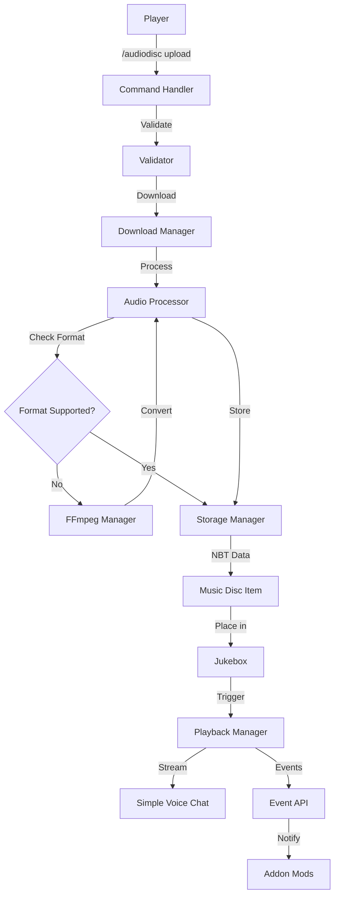

# Design Document: Custom Audio Disc System

## Overview

The Custom Audio Disc System is a server-side Minecraft Fabric mod that enables players to upload custom audio files to music discs via commands. The system integrates with Simple Voice Chat for spatial audio playback and provides a comprehensive API for addon developers.

### Key Features
- Command-based audio upload from URLs
- Persistent audio storage with NBT data
- Simple Voice Chat integration for spatial audio
- Event-driven API for addon development
- Asynchronous download and processing
- Comprehensive error handling

### Technology Stack
- Minecraft 1.21.8 (Fabric)
- Java 21
- Fabric API
- Simple Voice Chat API (integration)
- NBT for data persistence
- HTTP client for file downloads

## Architecture

### High-Level Architecture



### Component Layers

1. **Command Layer**: Handles player commands and input validation
2. **Download Layer**: Manages asynchronous file downloads with progress tracking
3. **Processing Layer**: Validates and processes audio files
4. **Storage Layer**: Persists audio data using NBT and file system
5. **Playback Layer**: Integrates with Simple Voice Chat for audio streaming
6. **API Layer**: Provides hooks for addon developers

## Components and Interfaces

### 1. Command System

#### AudioDiscCommand
```java
public class AudioDiscCommand {
    // Registers /audiodisc upload <url> command
    public static void register(CommandDispatcher<ServerCommandSource> dispatcher);
    
    // Handles command execution
    private static int executeUpload(ServerCommandSource source, String url);
    
    // Validates player is holding a music disc
    private static boolean validateHeldItem(ServerPlayerEntity player);
}
```

**Responsibilities:**
- Register commands with Fabric Command API
- Validate player permissions
- Validate held item is a music disc
- Initiate download process
- Provide user feedback

### 2. Download Manager

#### AudioDownloadManager
```java
public class AudioDownloadManager {
    private final ExecutorService downloadExecutor;
    private final Map<UUID, DownloadTask> activeDownloads;
    
    // Initiates async download
    public CompletableFuture<AudioFile> downloadAudio(String url, UUID playerId);
    
    // Tracks download progress
    public void reportProgress(UUID downloadId, int percentage);
    
    // Cancels active download
    public void cancelDownload(UUID downloadId);
    
    // Validates URL format and accessibility
    private boolean validateUrl(String url);
}
```

**Responsibilities:**
- Asynchronous HTTP downloads
- Progress tracking and reporting
- Timeout enforcement (30 seconds)
- File size validation
- Connection management

#### DownloadTask
```java
public class DownloadTask {
    private final UUID taskId;
    private final String url;
    private final UUID playerId;
    private volatile int progress;
    private volatile DownloadStatus status;
    
    public void execute();
    public void cancel();
    public int getProgress();
}
```

### 3. Audio Processing

#### AudioProcessor
```java
public class AudioProcessor {
    private static final Set<String> SUPPORTED_FORMATS = Set.of("mp3", "ogg", "wav");
    private static final Set<String> CONVERTIBLE_FORMATS = Set.of("m4a", "webm", "aac", "flac");
    private static final long MAX_FILE_SIZE = 50 * 1024 * 1024; // 50MB
    
    private final FFmpegManager ffmpegManager;
    
    // Validates audio file format
    public ValidationResult validateFormat(byte[] audioData);
    
    // Extracts metadata (duration, bitrate, etc.)
    public AudioMetadata extractMetadata(byte[] audioData);
    
    // Converts to optimal format if needed
    public byte[] processAudio(byte[] audioData);
    
    // Converts unsupported formats using FFmpeg
    public byte[] convertAudio(byte[] audioData, String sourceFormat, String targetFormat);
}
```

#### FFmpegManager
```java
public class FFmpegManager {
    private final Path ffmpegExecutable;
    private final boolean autoInstallEnabled;
    
    // Checks if FFmpeg is available
    public boolean isFFmpegAvailable();
    
    // Automatically downloads and installs FFmpeg
    public CompletableFuture<Boolean> ensureFFmpegInstalled();
    
    // Converts audio file using FFmpeg
    public CompletableFuture<byte[]> convertAudio(byte[] input, String inputFormat, String outputFormat);
    
    // Detects current platform for appropriate binary
    private Platform detectPlatform();
    
    // Downloads FFmpeg binary for current platform
    private CompletableFuture<Path> downloadFFmpeg();
    
    // Verifies FFmpeg installation and version
    private boolean verifyFFmpegInstallation(Path executable);
}
```

**Responsibilities:**
- Format validation (MP3, OGG, WAV)
- File size checking
- Metadata extraction
- Optional format conversion
- Audio integrity verification

#### AudioMetadata
```java
public record AudioMetadata(
    String format,
    long duration,
    int bitrate,
    int sampleRate,
    String title
) {}
```

### 4. Storage System

#### AudioStorageManager
```java
public class AudioStorageManager {
    private final Path storageDirectory;
    private final Map<String, AudioData> audioCache;
    
    // Stores audio file and returns unique ID
    public String storeAudio(byte[] audioData, AudioMetadata metadata);
    
    // Retrieves audio data by ID
    public Optional<AudioData> getAudio(String audioId);
    
    // Attaches audio ID to music disc NBT
    public void attachToDisc(ItemStack disc, String audioId);
    
    // Retrieves audio ID from music disc NBT
    public Optional<String> getDiscAudioId(ItemStack disc);
    
    // Clears old/unused audio files
    public void cleanup();
}
```

**Storage Structure:**
```
server/
└── audio_disc/
    ├── audio/
    │   ├── <uuid>.ogg
    │   ├── <uuid>.ogg
    │   └── ...
    └── metadata.json
```

**NBT Structure on Music Disc:**
```json
{
  "audio_disc": {
    "audio_id": "uuid-string",
    "uploaded_by": "player-name",
    "upload_time": 1234567890,
    "metadata": {
      "title": "Song Name",
      "duration": 180000,
      "format": "ogg"
    }
  }
}
```

### 5. Playback System

#### PlaybackManager
```java
public class PlaybackManager {
    private final Map<BlockPos, ActivePlayback> activePlaybacks;
    private final SimpleVoiceChatIntegration voiceChatIntegration;
    
    // Starts playback when disc inserted
    public void startPlayback(ServerWorld world, BlockPos jukeboxPos, ItemStack disc);
    
    // Stops playback when disc removed
    public void stopPlayback(BlockPos jukeboxPos);
    
    // Gets current playback state
    public Optional<ActivePlayback> getPlayback(BlockPos jukeboxPos);
}
```

#### SimpleVoiceChatIntegration
```java
public class SimpleVoiceChatIntegration {
    private VoicechatServerApi voicechatApi;
    
    // Initializes SVC integration
    public void initialize();
    
    // Creates audio stream for jukebox
    public AudioStream createStream(BlockPos position, byte[] audioData);
    
    // Manages spatial audio positioning
    public void updateStreamPosition(AudioStream stream, BlockPos position);
    
    // Stops and cleans up stream
    public void stopStream(AudioStream stream);
}
```

**Integration Approach:**
- Use Simple Voice Chat's `VoicechatServerApi`
- Create locational audio source at jukebox position
- Stream audio data in chunks
- Handle player proximity for spatial audio
- Synchronize playback across clients

#### ActivePlayback
```java
public class ActivePlayback {
    private final String audioId;
    private final BlockPos position;
    private final AudioStream stream;
    private final long startTime;
    private final AudioMetadata metadata;
    
    public boolean isPlaying();
    public long getElapsedTime();
    public void stop();
}
```

### Content Type Validation

The system validates HTTP Content-Type headers to ensure downloaded files are audio files. The following content types are accepted:

- `audio/*` (any audio MIME type: audio/mpeg, audio/ogg, audio/wav, etc.)
- `application/octet-stream` (generic binary stream, commonly used by CDNs)
- `application/ogg` (OGG container format)
- `application/binary` (binary data, used by some file hosting services like Dropbox)

**Rationale:** Different file hosting services and CDNs return different content types for the same audio files. For example, Dropbox returns `application/binary` for MP3 files. The validation should be permissive enough to accept legitimate audio files while still providing basic protection against obviously non-audio content.

### 6. Event API

#### AudioDiscAPI
```java
public interface AudioDiscAPI {
    // Registers event listener
    void registerListener(AudioEventListener listener);
    
    // Unregisters event listener
    void unregisterListener(AudioEventListener listener);
    
    // Gets audio metadata
    Optional<AudioMetadata> getAudioMetadata(String audioId);
    
    // Checks if disc has custom audio
    boolean hasCustomAudio(ItemStack disc);
}
```

#### AudioEventListener
```java
public interface AudioEventListener {
    // Called when playback starts
    void onPlaybackStart(PlaybackStartEvent event);
    
    // Called when playback stops
    void onPlaybackStop(PlaybackStopEvent event);
    
    // Called when audio is uploaded
    void onAudioUpload(AudioUploadEvent event);
    
    // Allows modification before playback
    default AudioModification modifyAudio(AudioModificationContext context) {
        return AudioModification.noChange();
    }
}
```

#### Event Classes
```java
public record PlaybackStartEvent(
    BlockPos jukeboxPos,
    ServerWorld world,
    String audioId,
    AudioMetadata metadata,
    long timestamp
) {}

public record PlaybackStopEvent(
    BlockPos jukeboxPos,
    ServerWorld world,
    String audioId,
    long playbackDuration,
    StopReason reason
) {}

public record AudioUploadEvent(
    ServerPlayerEntity player,
    ItemStack disc,
    String audioId,
    AudioMetadata metadata,
    long timestamp
) {}

public enum StopReason {
    DISC_REMOVED,
    PLAYBACK_COMPLETE,
    JUKEBOX_BROKEN,
    MANUAL_STOP
}
```

## Data Models

### AudioData
```java
public class AudioData {
    private final String id;
    private final byte[] data;
    private final AudioMetadata metadata;
    private final String uploadedBy;
    private final long uploadTime;
    
    // Getters and serialization methods
}
```

### DownloadStatus
```java
public enum DownloadStatus {
    PENDING,
    DOWNLOADING,
    PROCESSING,
    COMPLETE,
    FAILED,
    CANCELLED
}
```

### ValidationResult
```java
public record ValidationResult(
    boolean valid,
    String errorMessage,
    Set<String> supportedFormats
) {
    public static ValidationResult success() {
        return new ValidationResult(true, null, Set.of());
    }
    
    public static ValidationResult failure(String message) {
        return new ValidationResult(false, message, 
            Set.of("mp3", "ogg", "wav"));
    }
}
```

## Error Handling

### Error Categories

1. **Command Errors**
   - Invalid URL format
   - No music disc in hand
   - Insufficient permissions

2. **Download Errors**
   - URL unreachable (404, timeout)
   - File too large
   - Network errors
   - Timeout (30 seconds)

3. **Processing Errors**
   - Unsupported format
   - Corrupted file
   - Invalid audio data

4. **Playback Errors**
   - Simple Voice Chat not installed
   - Audio file not found
   - Stream initialization failure

### Error Handling Strategy

```java
public class AudioDiscException extends Exception {
    private final ErrorType type;
    private final String userMessage;
    
    public enum ErrorType {
        INVALID_URL,
        DOWNLOAD_FAILED,
        UNSUPPORTED_FORMAT,
        FILE_TOO_LARGE,
        NO_DISC_IN_HAND,
        STORAGE_ERROR,
        PLAYBACK_ERROR
    }
}
```

**User Feedback:**
- All errors display user-friendly messages
- Technical details logged to server console
- Progress updates during long operations
- Success confirmations with metadata

**Logging:**
```java
private static final Logger LOGGER = LoggerFactory.getLogger("AudioDisc");

// Log levels:
// ERROR: Critical failures
// WARN: Recoverable issues
// INFO: Important operations
// DEBUG: Detailed debugging info
```

## Testing Strategy

### Unit Tests

1. **Command Tests**
   - Command registration
   - Permission validation
   - Held item validation
   - URL parsing

2. **Download Tests**
   - URL validation
   - Timeout handling
   - Progress tracking
   - Cancellation

3. **Processing Tests**
   - Format detection
   - Metadata extraction
   - File size validation
   - Format conversion

4. **Storage Tests**
   - NBT serialization/deserialization
   - File system operations
   - Cache management
   - Cleanup operations

5. **API Tests**
   - Event listener registration
   - Event firing
   - Metadata retrieval

### Integration Tests

1. **End-to-End Upload Flow**
   - Command → Download → Process → Store → Attach to disc

2. **Playback Flow**
   - Disc insertion → Audio retrieval → SVC streaming → Playback

3. **API Integration**
   - Event listener receives correct events
   - Audio modification works correctly

### Manual Testing Checklist

- [ ] Upload audio from valid URL
- [ ] Upload with invalid URL
- [ ] Upload without holding disc
- [ ] Upload file that's too large
- [ ] Upload unsupported format
- [ ] Place custom disc in jukebox
- [ ] Verify audio plays through SVC
- [ ] Remove disc during playback
- [ ] Server restart preserves audio
- [ ] Multiple jukeboxes playing simultaneously
- [ ] API events fire correctly

## Implementation Notes

### Dependencies to Add

```gradle
dependencies {
    // Existing dependencies...
    
    // Simple Voice Chat API
    modImplementation "de.maxhenkel.voicechat:voicechat-api:2.5.0"
    
    // HTTP client (if not using Java 11+ HttpClient)
    // implementation 'com.squareup.okhttp3:okhttp:4.12.0'
    
    // Audio processing (optional, for format conversion)
    // implementation 'com.googlecode.soundlibs:jlayer:1.0.1.4'
}
```

### Configuration File

Create `config/audiodisc.json`:
```json
{
  "maxFileSize": 52428800,
  "downloadTimeout": 30,
  "supportedFormats": ["mp3", "ogg", "wav"],
  "enableProgressUpdates": true,
  "progressUpdateInterval": 25,
  "storageDirectory": "audio_disc/audio",
  "enableApiEvents": true
}
```

### Mixins Required

1. **JukeboxBlockEntityMixin**
   - Intercept disc insertion
   - Intercept disc removal
   - Trigger playback events

2. **ItemStackMixin** (optional)
   - Custom tooltip for audio discs
   - Display metadata in hover text

### Performance Considerations

1. **Async Operations**
   - All downloads run on separate thread pool
   - Non-blocking command execution
   - Cached audio data in memory

2. **Memory Management**
   - LRU cache for frequently played audio
   - Lazy loading from disk
   - Cleanup of unused files

3. **Network Optimization**
   - Connection pooling
   - Timeout enforcement
   - Bandwidth limiting (optional)

## Security Considerations

1. **URL Validation**
   - Whitelist allowed protocols (HTTP/HTTPS only)
   - Block local file access
   - Block internal network ranges
   - Validate content-type headers

2. **File Size Limits**
   - Hard limit at 50MB
   - Configurable per-server
   - Prevent DoS via large files

3. **Rate Limiting**
   - Max uploads per player per minute
   - Cooldown between uploads
   - Server-wide concurrent download limit

4. **Permissions**
   - Require permission node for upload command
   - Separate permission for admin commands
   - Integration with permission mods

## Future Enhancements

1. **Playlist Support**
   - Multiple discs in sequence
   - Shuffle mode
   - Repeat functionality

2. **Audio Effects**
   - Volume control
   - Reverb/echo effects
   - Equalizer settings

3. **Web Interface**
   - Upload via web panel
   - Browse uploaded audio
   - Share audio between players

4. **Advanced API**
   - Audio visualization data
   - Real-time audio modification
   - Custom audio sources
