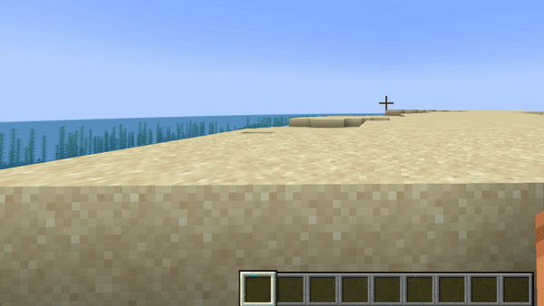
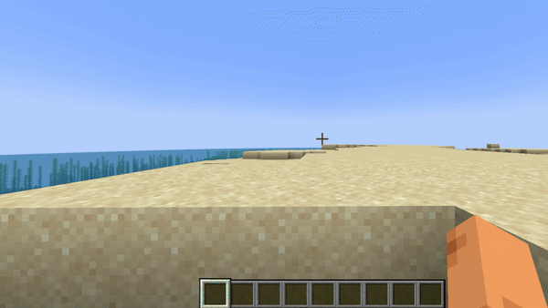

# Voice messages
Mod and plugin that adds voice messages to the Minecraft. <p>
Requires [Simple Voice Chat](https://modrinth.com/plugin/simple-voice-chat) installed.



## Good to know
This mod must be installed both on server and client to work. If a player does not have this mod installed, he will not see voice messages. <p>
This mod uses the microphone configured in Simple Voice Chat with all its settings. So make sure that `Voice Amplification` in Simple Voice Chat settings is not set to `-100%`. <p>
Also, if voicechat sounds are disabled, you will not hear voice messages.

## Private voice messages

You can send private voice messages to players or to your team with `/voicemsg <target>` or `/vmsg <target>` commands. <p>
Note that server can restrict you from sending them by permissions



## Setup on server

### Config
Server config is located in `config/voicemessages_server.json` <p>
Here are the default values with their descriptions: <p>
```
{
  "max_voice_message_duration_ms": 90000,  // The maximum voice message length in milliseconds in range [3_000;300_000]
  "voice_message_spam_punishment": "none", // The punishment for sending a voice message longer than the time elapsed since the sending previous one. Possible values: "none", "prevent", "kick"
  "voice_message_invalid_punishment": "prevent", // The punishment for sending an invalid voice message (longer than maximum configured) or sending a voice message without permission for it. Possible values: "none", "prevent", "kick"
  "mod_required": false,                         // If true, joining players will be kicked if they don't have this mod installed
  "mod_not_installed_text": "VoiceMessages is not installed or is of an old version" // The kick message for players that don't have this mod installed
}
```

### Permissions
- `voicemessages.send` - permission to send voice messages. Default: `true`
- `voicemessages.send.all` - permission to send voice messages to global chat. Default: `true`
- `voicemessages.send.team` - permission to send private voice messages to player's team. Default: `true`
- `voicemessages.send.players` - permission to send private voice messages to players. Default: `true`

## API
This mod has its own API. <p>
Setup in `build.gradle`:
```
repositories {
    // Other repositories
    
    maven {
        name "KvotheShaed Releases"
        url "https://maven.kvotheshaed.ru/releases"
    }
}

dependencies {
    // Other dependencies

    // Voice Messages API
    compileOnly "ru.dimaskama.voicemessages:voicemessages-api:${voicemessages_api_version}"
}
```